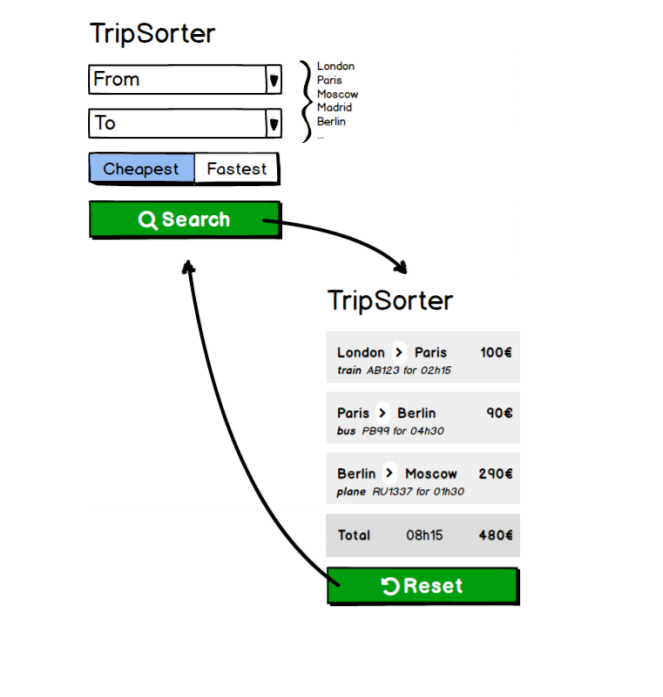

## Property Finder Test ##

A travel agency wants to create a simple Web App to help their customers find the cheapest
or fastest way to travel from a city to another.
You are asked to create a simple Web App that will find the complete continuous path to go
from a city to another, considering different sorting types (cheapest or fastest).
The travel agency has an existing API that will provide you all the available transportation
deals.

You will find the API response in the JSON file “response.json” attached to this test. You
don’t need to code a server­side API, your Web App should instead load “response.json” as
if it was an API response.

Your project manager provided you the following mockup as a briefing:




The client provided you the following API documentation for one deal:

```
{
    "transport": "train",
    "departure": "London",
    "arrival": "Amsterdam",
    "duration": {
        "h": "03",
        "m": "30"
    },
    "cost": 160,
    "discount": 50,
    "reference": "TLA0330"
}
```

transport train, bus, car
departure departure city’s name in English
arrival arrival city’s name in English
duration.h trip’s duration hours
duration.m trip’s duration minutes
cost cost not discounted, this is the base price
discount discount in % to apply to the base price
reference deal unique reference number

This task is designed to give us an idea of:
* your ability to deliver an appropriate, simple solution to a given problem.
* how you structure your code.
* your understanding of JS functional programming.
* your complete frontend skills (JS, HTML and CSS).
* the efficiency of your pathfinding algorithm.
* how you select frameworks / third party libraries to help you solve a given problem.

Bonus:
* Feel free to implement any improvements that would showcase your UI/UX skills